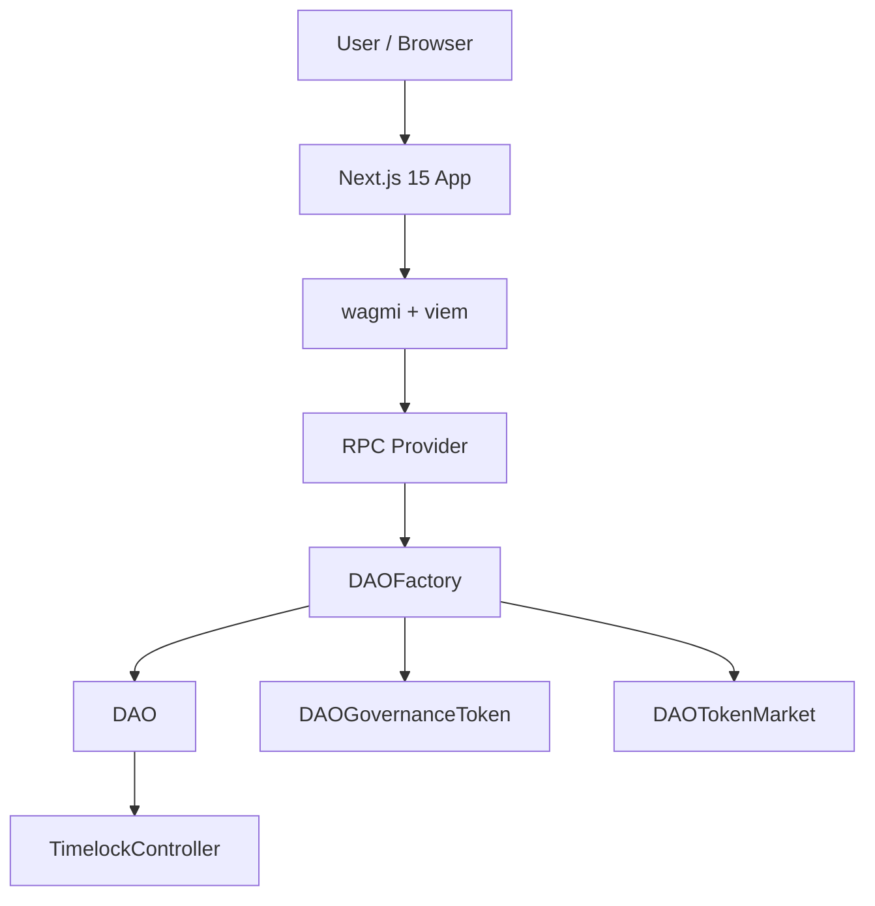

<h1 align="center">DAO Governance Monorepo</h1>

<p align="center">
  A full-stack DAO governance platform with bonding curve token markets
</p>

<p align="center">
  
  
  
  
  
  
</p>

> [!WARNING]
> This project is for educational and demonstration purposes only. It has not
> been formally audited and should not be used in production without a full
> professional security review.

## Table of Contents

- [Features](#features)
- [Architecture](#architecture)
- [Tech Stack](#tech-stack)
- [Workspace Layout](#-workspace-layout)
- [Prerequisites](#-prerequisites)
- [Install](#-install)
- [Contracts](#-contracts)
- [Frontend](#-frontend)
- [End-to-End Flow](#-end-to-end-flow)
- [Contributing](#contributing)
- [Security](#security)
- [License](#license)

## Features

- 🚀 One-click DAO creation via `DAOFactory` deployment and `createDAO(...)`
- 🗳️ ERC20Votes-based governance tokens with on-chain delegation support
- 🏛️ OpenZeppelin Governor + Timelock governance lifecycle controls
- 📈 ETH bonding curve token markets for DAO-native token price discovery
- 🔄 Proposal flow: create, vote, queue, and execute with timelock delay
- ⚡ Next.js 15 App Router frontend for DAO and token market interactions
- 🔌 Wallet-ready integration using RainbowKit + wagmi + viem

## Architecture



## Tech Stack

| Technology | Purpose |
| --- | --- |
| Foundry | Smart contract framework for build, test, and deploy |
| Solidity 0.8.24 | Core smart contract language |
| OpenZeppelin Contracts | Governance, token, timelock, and security primitives |
| Next.js 15 | Frontend framework with App Router |
| React 19 | UI rendering and component model |
| wagmi 2 + viem 2 | Wallet connection and EVM client interactions |
| RainbowKit 2 | Wallet UX and multi-wallet onboarding |
| TailwindCSS 3 | Utility-first styling in the frontend |
| Recharts | Governance/token data visualization |
| pnpm workspaces | Monorepo package and dependency management |

## 🧱 Workspace Layout

```text
.
├── packages/contracts
│   ├── src
│   │   ├── DAOFactory.sol
│   │   ├── DAO.sol
│   │   ├── DAOGovernanceToken.sol
│   │   └── DAOTokenMarket.sol
│   ├── script/Deploy.s.sol
│   └── test
│       ├── DAOFactory.t.sol
│       └── DAOFlow.t.sol
└── packages/web
    ├── app
    ├── components
    └── lib
```

## ✅ Prerequisites

- Node.js 22+
- pnpm (enabled via corepack)
- Foundry (`forge`)

## 📦 Install

```bash
corepack enable
corepack prepare pnpm@10.6.2 --activate
pnpm install
```

## ⛓️ Contracts

### Build & Test

```bash
cd packages/contracts
~/.foundry/bin/forge install OpenZeppelin/openzeppelin-contracts foundry-rs/forge-std
~/.foundry/bin/forge build
~/.foundry/bin/forge test
```

### Deploy

```bash
cd packages/contracts
PRIVATE_KEY=<your_key> ~/.foundry/bin/forge script script/Deploy.s.sol:Deploy \
  --rpc-url http://127.0.0.1:8545 \
  --broadcast
```

## 🌐 Frontend

Create `packages/web/.env.local`:

```bash
NEXT_PUBLIC_DAO_FACTORY_ADDRESS=0xYourFactoryAddress
NEXT_PUBLIC_CHAIN_ID=11155111
NEXT_PUBLIC_WALLETCONNECT_PROJECT_ID=your-walletconnect-project-id
NEXT_PUBLIC_SEPOLIA_RPC_URL=https://sepolia.infura.io/v3/your-key
NEXT_PUBLIC_LOCAL_RPC_URL=http://127.0.0.1:8545
```

Use `NEXT_PUBLIC_CHAIN_ID=31337` during local development with Anvil.
RainbowKit requires `NEXT_PUBLIC_WALLETCONNECT_PROJECT_ID` for WalletConnect,
and `NEXT_PUBLIC_SEPOLIA_RPC_URL` should stay configured when targeting Sepolia.

Run the app:

```bash
pnpm --filter web dev
```

## 🔁 End-to-End Flow

1. Deploy `DAOFactory`.
2. Call `createDAO(daoName, tokenName, tokenSymbol, initialSupply, ...)` from any EOA.
3. Open `/tokens` to discover created DAO markets.
4. Buy governance tokens from `/tokens/[token]`.
5. Delegate votes with the governance token contract.
6. Create a proposal in `/dao/[dao]`.
7. Vote, queue after the voting period, and execute after the timelock delay.

## Contributing

Contributions are welcome.

1. Fork the repository.
2. Create a feature branch.
3. Make your changes with focused commits.
4. Run `~/.foundry/bin/forge test` and `pnpm typecheck` before opening a PR.
5. Open a pull request describing your change and rationale.

## Security

This repository is designed for learning and demonstration. While contracts are
built with OpenZeppelin components, the system has not undergone a formal
security audit. Do not deploy this stack to mainnet without a professional
audit and additional hardening.

## License

MIT. Add a `LICENSE` file at the repository root to formalize distribution
terms.
